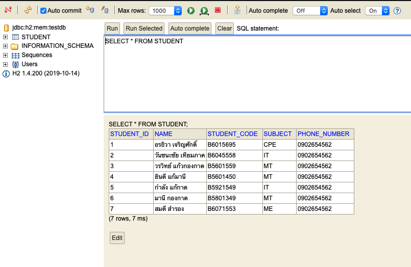
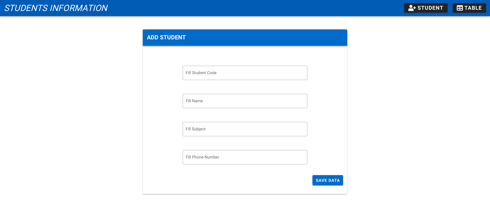
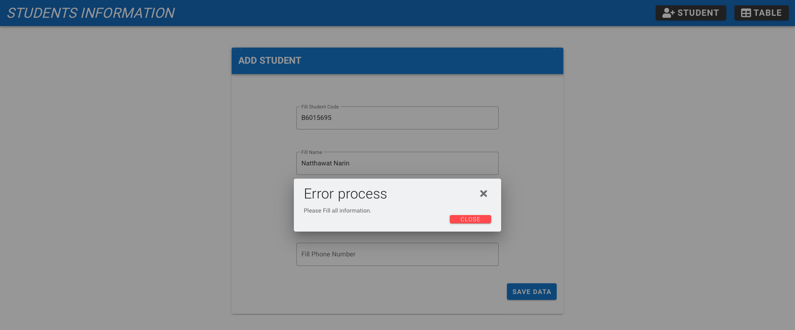
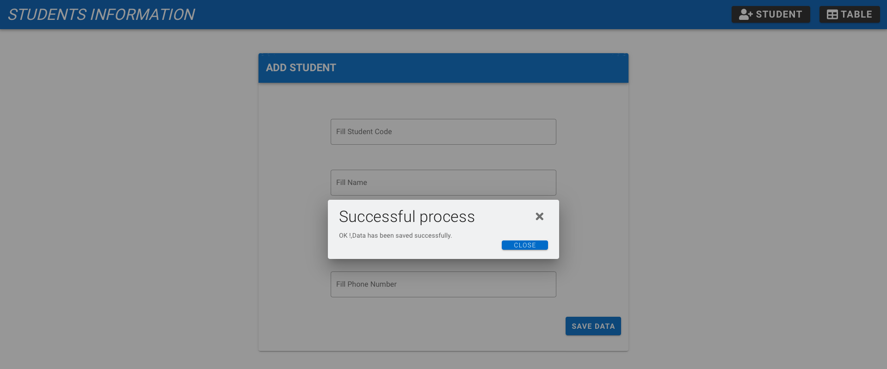
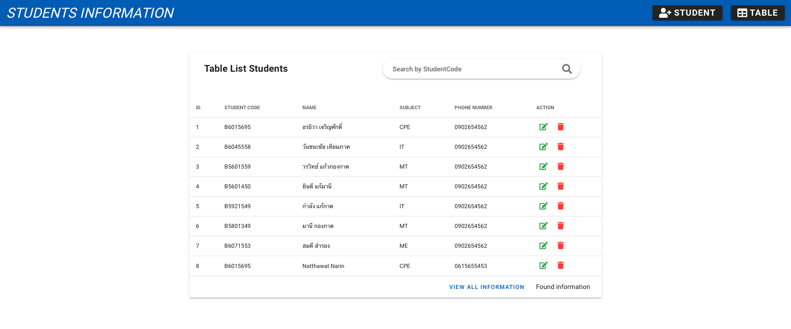
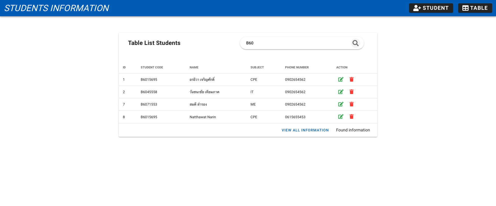
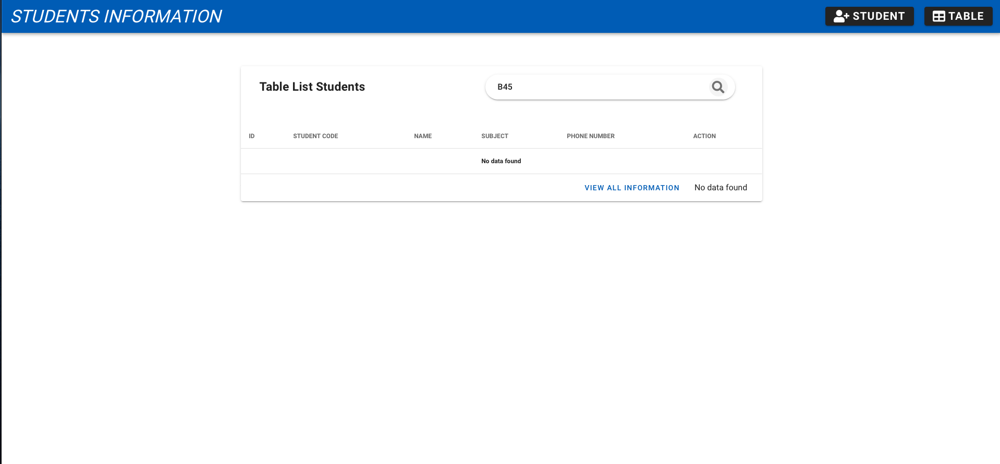
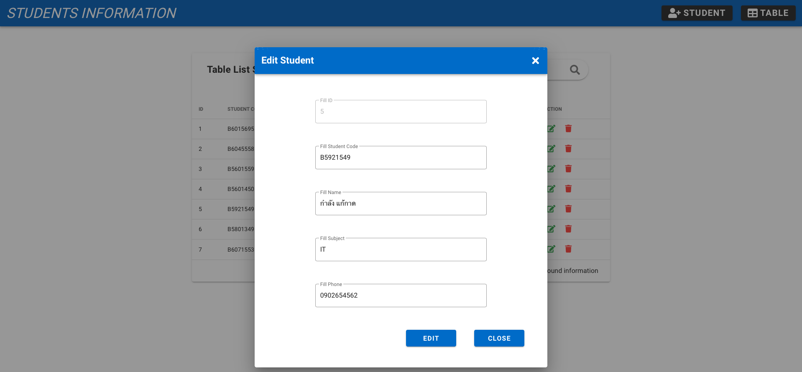

# vueJS-springBoot
java h2(RESTful API) using GET POST PATCH DELETE

### client using VueJS
* `cd client`
* `[node@12] npm install && yarn install`
* `yarn serve`
* `[open browser] http://localhost:8080/`

### server using Spring Boot
* `cd server`
* `[macOS] ./gradlew bootRun | gradlew bootRuno`
* `[open browser] http://localhost:9000/h2-console`
  ```
  application.yml :
    spring:
    jpa:
        show-sql: true
    h2:
        console:
        enabled: true

    server:  
    port : 9000
  ```

### UX/UI - Test
* h2.png
  <div style="text-align:center"></img></div>
* add_stu.png
  <div style="text-align:center"></img></div>
* add_error.png
  <div style="text-align:center"></img></div>
* add_success.png
  <div style="text-align:center"></img></div>
* table.png
  <div style="text-align:center"></img></div>
* find_studentCode.png
  <div style="text-align:center"></img></div>
* find_stu_found.png
  <div style="text-align:center"></img></div>
* edit_student.png
  <div style="text-align:center"></img></div>

